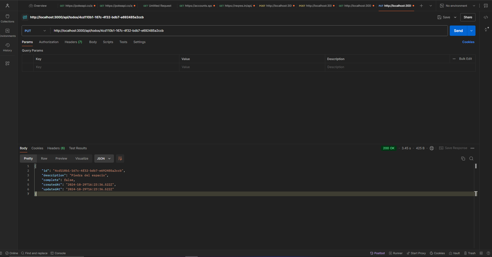

## Next API Routes - RESTful API - Handlers

Esta sección tiene por objetivo principal, crear un RESTful Api básico en Next, nos dará la base para seguir trabajando mediante una "application programming interface", en futuras secciones. El objetivo final es que podamos tener un endpoint lo suficientemente robusto para poder trabajar con él.

Puntualmente veremos:

- READ
- Paginaciones
- Update
- Post
- SEED
- Docker
- Postgres
- Prisma
- Prisma + Next
- Yup - Validador

## Inicio del proyecto - adminTodo

Creación de un RESTful API: En la carpeta _APP_, vamos a crear una nueva carpeta _api_ en donde a su vez, vamos crear el archivo _route.ts_

snippet para la creación rápida: rag

```js
import { NextResponse, NextRequest } from "next/server";

export async function GET(request: Request) {
  return NextResponse.json({
    hola: "mundo",
  });
}
```

Por ultimo probamos el endpoint en Postman: http://localhost:3000/api/hello

#### Agregar otra petición

Para agregar otra petición simplemente tenemos que copiar el export de arriba y cambiarle el método en este caso vamos a poner de ejemplo con el método POST :

```js
// rag snippets para creación

import { NextResponse, NextRequest } from "next/server";

export async function GET(request: Request) {
  return NextResponse.json({
    hola: "mundo",
  });
}

export async function POST(request: Request) {
  return NextResponse.json({
    hola: "mundo",
    method: "POST",
  });
}
```

## Configurar Postgres localmente

> [!IMPORTANTE]
>
> Todo esto hacer con el docker desktop abierto y corriendo.

Creamos en la raíz del proyecto el archivo _docker-compose.yml_ este archivo básicamente serán las instrucciones de como quiero subir mis imágenes.

1. version: se arranca el archivo con el numero de version.

2. services: vamos a crear el servicio todosDB.

> [!NOTA]
>
> los archivos .yml la tabulation es muy importante.
>
> NO USAR ESPACIOS.

3. todosDB: configuramos la _image_ que descargamos con el comando => docker pull postgres:15.3

4. container_name: nombre del contenedor o el DNS hacia el servidor donde esta nuestra base de datos:

5. restart : es por si reiniciamos la imagen o pc. Al configurar como 'always' esto nos asegura de estar levantando nuestra imagen siempre.

6. ports: tenemos que hacer chocar el puerto local con el puerto del contenedor. La base de datos de postgres tiene por defecto el 5432, por ende lo que nosotros queremos es comunicar el puerto 5432 de nuestro equipo/pc con el 5432 del contenedor.

7. environment: esto es para configurar nuestras variables de entorno. Creamos 2 Variables user y password.

8. volumen: nos permite conectar una carpeta de nuestra computadora con una carpeta del servidor.

el resultado es el siguiente:

```js
version: '3'

services:
  todosDB:
    image:  postgres:15.3
    container_name: todos-db
    restart: always
    ports:
      - 5432:5432
    environment:
      - POSTGRES_USER=postgres
      - POSTGRES_PASSWORD=postgres
    volumes:
      - ./postgres:/var/lib/postgresql/data

```

9. Una vez terminada la configuración del archivo _docker-compose.yml_, en la terminal ya sea en el visual o abriendo con la power shell o cmd vamos a pararnos en la carpeta del proyecto.

> [COMANDOS]
>
> pwd: nos ubica en la carpeta del proyecto
>
> ls: para verificar que estamos en la raíz del proyecto. (si nos tira lo package.json estamos bien ubicados).
>
> docker compose up -d : Este comando es para levantar la imagen, el -d significa detach que lo haga de manera desenlazada de la terminal.

10. Por ultimo nos queda verificar que todo se ha creado perfectamente, para ello nos vamos a docker desktop, en la opción container


11. Nos vamos a tablePlus para probar la base de datos:

- Tocamos el +
- seleccionamos PostgreSQL
- definimos la conexión: configuramos la conexión
  > [IMPORTANTE]
  >
  > Aquí vamos a utilizar las variables de entorno tanto para el usuario como para el password que definimos en el punto 7.
- Por ultimo pulsamos TEST y si nos sale todo en verde tenemos establecida nuestra conexión


## Prisma + NextJs

Prisma se usa para facilitar la interacción con bases de datos SQL y no-SQL y se integra perfectamente en aplicaciones Next.js, permitiéndote definir y manipular modelos de datos de forma eficiente.

> [IMPORTANTE]
>
> Nos permite modelar o tener objects _evitando tener que hacer queries_ como seleccionar tabla, insertar en tabla etc.

[Prisma Documentación](https://www.prisma.io/docs/orm/overview/introduction/what-is-prisma)

[Vercel Documentación: Para crear el prisma client (para trabajar con nuestro object, modelos que vamos a crear)](https://vercel.com/guides/nextjs-prisma-postgres)

## Conectar Prisma con Next

- En la terminal vamos a ejecutar el siguiente comando:

```
 npx prisma init
```

- Este comando nos crear el archivo .env con el database_url. En la cual tenemos que editar con nuestros datos. Tenemos que modificar el usuario, password, puerto y la db.

- Ejecutado el comando en la terminal nos da una serie de pasos:

1. En el archivo .env tenemos que establecer el DATABASE_URL o la variable de entorno de nuestra base.
2. Establecer el _provider_ de _datasource_ para establecer un _scheman.prisma_ esto nos habilita trabajar con: postgresql, mysql, SQLite, mongodb o cockroach db.
3. Ejecutar el comando : npx prisma db pull para convertir una base de datos en prisma.
4. Ejecutar el comando: npx prisma generate para generar el PRISMA CLIENT.

- Por otra parte, creamos un archivo copia del .env con el nombre .env.template. Este archivo servirá de guía para los compañeros que se sume al proyecto o que quiera hacer las configuraciones base en caso de clonar nuestro repo.

- Ahora vamos a trabajar en la carpeta _PRISMA_ en el archivo _schema.prisma_: En este archivo vamos a definir los modelos con los cuales vamos a trabajar.
  NOTA: un MODELO representa una tabla dentro de la base de datos.

```js
generator client {
  provider = "prisma-client-js"
}

datasource db {
  provider = "postgresql"
  url      = env("DATABASE_URL")
}

model Todo {
  id          String   @id @default(uuid())
  description String
  complete    Boolean  @default(false)
  createdAt   DateTime @default(now())
  updatedAt   DateTime @updatedAt
}

```

Nota: @default() es para establecer el valor por defecto por ejemplo en la propiedad complete lo establecemos como false.

- Como hicimos una modificación en la base de datos o en nuestra estructura de datos tenemos que ejecutar una migración. Esto se debe que al agregar el model Todo es nuestra primera modificación a la base de datos.
  Para ellos vamos a utilizar el siguiente comando:

```
npx prisma migrate dev
```

Nota: _dev_ seria el nombre de nuestra migración, podemos ponerle cualquier nombre.

> [IMPORTANTE]
>
> Este comando crea el proceso de migración, verifica la variables de entorno. Realiza los cambios y procesos necesarios para que nuestra base de datos y nuestro modelo estén en sintonía o en sincronía. Esto para asegurarle a prisma que los cambios que hagamos afectan la base de datos.
>
> NO OLVIDAR: CADA VEZ QUE HAGAMOS CAMBIOS TENEMOS QUE HACER LAS MIGRACIONES CORRESPONDIENTE.

- Una vez terminado el proceso del comando, nos vamos a tablePlus y apretamos ctrl + R, Si todo lo hicimos correctamente vamos a poder ver lo siguiente:
  

- Por ultimo vamos a ejecutar el comando para generar el CLIENTE DE PRISMA (PRISMA CLIENT) para poder hacer las manipulaciones de la base de datos.

```
npx prisma generate
```

Importante seguir las recomendaciones que nos da el link de vercel:
[Vercel Documentación: Para crear el prisma client (para trabajar con nuestro object, modelos que vamos a crear)](https://vercel.com/guides/nextjs-prisma-postgres)

Tenemos que crear una nueva carpeta dentro de SRC / LIB/ prisma.ts

```js
import { PrismaClient } from "@prisma/client";

let prisma: PrismaClient;

if (process.env.NODE_ENV === "production") {
  prisma = new PrismaClient();
} else {
  if (!global.prisma) {
    global.prisma = new PrismaClient();
  }
  prisma = global.prisma;
}

export default prisma;
```

Hacemos modificaciones en el archivo en la propiedad global especificando su tipado en este caso any:

```js
import { PrismaClient } from '@prisma/client';

let prisma: PrismaClient;

if (process.env.NODE_ENV === 'production') {
  prisma = new PrismaClient();
} else {
  if (!(global as any).prisma) {
    (global as any).prisma = new PrismaClient();
  }
  prisma = (global as any).prisma;
}

export default prisma;

```

## Generar semilla de base de datos

La semilla sirve como una copia de la base de datos para poder hacer las pruebas pertinentes, probar la app, insertar datos ficticios sin destruir o sobrecargar la base de datos real.
En nuestro caso la información semilla de la base de datos seria crear un par de To do.

1.  Vamos a crear un endpoint y una vez creado lo vamos a probar en postman: http://localhost:3000/api/seed
    Para crearlo vamos a ir a nuestra carpeta API, vamos a crear la carpeta SEED y dentro el archivo route.ts.
    Nota: RAG es el snippet que configuramos para la creación rápida del archivo route.ts

```js
import { NextResponse, NextRequest } from "next/server";

export async function GET(request: Request) {
  return NextResponse.json({
    message: "Seed Executed",
  });
}
```

2. Ahora tenemos que hacer una inserción a la base de datos. Primero haremos una inserción básica y luego una masiva.
   Para la básica:

- Preparamos la inserción de la base de datos.
- Utilizamos prisma que hemos creado en la carpeta lib/prisma.
- Seleccionamos el model para nosotros seria 'todo'.
- Al hacer punto, nos salen todas los métodos que podemos utilizar sobre 'todo' en este caso buscar crear por ende utilizaremos _create_
- Especificamos la data que es la información que quiero insertar en un todo.
  Nota: todas son opcionales excepto la description porque asi lo definimos en nuestro model.
- agregamos un await para esperar la creación y lo guardamos en una constante.

```js
import prisma from "@/lib/prisma";
import { NextResponse, NextRequest } from "next/server";

export async function GET(request: Request) {
  const todo = await prisma.todo.create({
    data: {
      description: "Piedra del alma",
    },
  });
  console.log("🚀 ~ GET ~ todo:", todo);

  return NextResponse.json({
    message: "Seed Executed",
  });
}
```

Para ver el todo creado, tenemos que ejecutar en postman => http://localhost:3000/api/seed
Y en la terminal del visual nos salen estos datos:


También podemos ver el elemento creado en TablePlus:


- La IDEA usualmente del SEED es que purge la base de datos y la deje de manera tal que pueda trabajar tranquilo en ella sin que me vaya duplicando la data. Para ello vamos agregar la siguiente linea de código en nuestro route.ts

```js
await prisma.todo.deleteMany(); // delete * from todo
```

Tambien podemos especificar que elementos queremos borrar:

```js
await prisma.todo.deleteMany({
  where: {
    complete: false,
  },
}); // delete from todo where complete = false
```

Para la masiva:

- Primero borramos la anterior tabla que teniamos:

```js
await prisma.todo.deleteMany(); // delete * from todo
```

- Preparamos la inserción de la base de datos.
- Utilizamos _prisma_ que hemos creado en la carpeta lib/prisma.
- Seleccionamos el model para nosotros seria 'todo'.
- Al hacer punto, nos salen todas los métodos que podemos utilizar sobre 'todo' en este caso buscar crear de manera masiva por ende utilizaremos _createMany_
- Especificamos la data a diferencia de la forma básica que la información que quiero insertar era un todo, aquí tenemos que insertar un arreglo con todos:

```js
// insert masivo
await prisma.todo.createMany({
  data: [
    { description: "Piedra del alma", complete: true },
    { description: "Piedra del poder" },
    { description: "Piedra del tiempo" },
    { description: "Piedra del espacio" },
    { description: "Piedra del realidad" },
  ],
});
```

Nota: todas son opcionales excepto la description porque asi lo definimos en nuestro model.

- agregamos un await para esperar la creación.
- Ejecutamos en postman el endpoint y volvemos al tablePlus: En este caso nos creo todo el arreglo con los distintos todo individuales

  

NOTA: cada vez que ejecutemos el seed en postman vamos a perder los id porque nos genera nuevos uuid().

## Lista todas las entradas

En este caso queremos crear un nuevo endpoint: http://localhost:3000/api/todos para poder listar todos los todo creados.

1. Creamos dentro de la carpeta API, la carpeta todo y dentro de ella el archivo route.ts.
2. utilizamos el snippet rag para hacer la creación del archivo.
3. En este caso para traer todos los elementos utiliza el método _findMany()_

```js
import prisma from "@/lib/prisma";
import { NextResponse, NextRequest } from "next/server";

export async function GET(request: Request) {
  const todos = await prisma.todo.findMany({});
}
```

4. Ahora retornamos los todos

```js
import prisma from "@/lib/prisma";
import { NextResponse, NextRequest } from "next/server";

export async function GET(request: Request) {
  const todos = await prisma.todo.findMany();
  return NextResponse.json(todos);
}
```

5. Probamos en postman el endpoint y si todo sale correctamente podemos visualizar los 5 todo que tenemos:


## Pagination simple

Para la paginacion vamos a seguir los pasos que nos provee [Documentación Prisma](https://www.prisma.io/docs/orm/prisma-client/queries/pagination).

Básicamente seria tomar del findMany(), por un lado, el skip y por otro, el take.

#### Como obtengo esos queries params?

Mediante los pasos que nos recomienda la documentación de next => [Route Handlers](https://nextjs.org/docs/app/building-your-application/routing/route-handlers).

Pasos:

1. Definir como vamos a tomar los valores (skip y take)
2. Para tomar un query params tenemos que utilizar las siguientes linea de código. En este caso de la request toma el searchParams y luego lo usa para traer el 'take' y en caso de no encontrarlo que tome por defecto los 10 primeros.

```js
const { searchParams } = new URL(request.url);
const take = searchParams.get("take") ?? "10";
```

la idea radica en poder hacer una consulta al siguiente endpoint: http://localhost:3000/api/todos?take=2

3. Utilizamos el take en el findMany pero agregandole el simbolo + para transformarlo en numero porque take espera un numero:

```js
const todos = await prisma.todo.findMany({
  take: +take,
});
```

Sin embargo nos tenemos que asegurar antes de enviar el take de que efectivamente pueda ser un numero y por esta razón agregamos la siguiente verificación :

```js
import prisma from "@/lib/prisma";
import { NextResponse, NextRequest } from "next/server";

export async function GET(request: Request) {
  const { searchParams } = new URL(request.url);
  const take = searchParams.get("take") ?? "10";

  if (isNaN(+take)) {
    return NextResponse.json(
      { message: "take tiene que ser un numero" },
      { status: 400 }
    );
  }

  const todos = await prisma.todo.findMany({
    take: +take,
  });

  return NextResponse.json(todos);
}
```

4. Probamos el endpoint en postman y si todo esta correcto nos tiene que traer los 2 primeros:


5. Ahora vamos a tomar el skip, para ellos vamos a hacer el mismo procedimiento con la verificación de que skip tiene que ser un numero:

```js
import prisma from '@/lib/prisma'
import { NextResponse, NextRequest } from 'next/server'

export async function GET(request: Request) {

   const {searchParams} = new URL(request.url);
   const take = searchParams.get('take') ?? '10';
   const skip = searchParams.get('skip') ?? '0';


   if( isNaN(+take)){
    return NextResponse.json({ message: 'take tiene que ser un numero'}, {status:400})
   }

   if( isNaN(+skip)){
    return NextResponse.json({ message: 'skip tiene que ser un numero'}, {status:400})
   }

  const todos = await prisma.todo.findMany({
    take: +take,
    skip: +skip,

  });

  return NextResponse.json(todos);

```

la idea radica en poder hacer una consulta al siguiente endpoint: http://localhost:3000/api/todos?take=2&skip=2
Si todo sale correcto nos tiene que mostrar la consulta 2 todo, uno con la piedra del espacio y otro con la piedra del tiempo:


### Evitar hacer la conversion con + en muchas lineas de código:

Podemos simplificar nuestro código de la siguiente manera: Podemos utilizar el + o la palabra number para especificar la conversion. Esto lo hacemos con la finalidad de que nuestro código quede mas legible. Siempre debemos apuntar a la legibilidad.

```js
import prisma from "@/lib/prisma";
import { NextResponse, NextRequest } from "next/server";

export async function GET(request: Request) {
  const { searchParams } = new URL(request.url);
  const take = +(searchParams.get("take") ?? "10");
  const skip = Number(searchParams.get("skip") ?? "0");

  if (isNaN(take)) {
    return NextResponse.json(
      { message: "take tiene que ser un numero" },
      { status: 400 }
    );
  }

  if (isNaN(skip)) {
    return NextResponse.json(
      { message: "skip tiene que ser un numero" },
      { status: 400 }
    );
  }

  const todos = await prisma.todo.findMany({
    take,
    skip,
  });

  return NextResponse.json(todos);
}
```

### Retornar una única entrada

Una vez terminada la pagination y listado todos los todos. Nuestro siguiente objetivo es poder listar solamente una unica entrada, un único todo para ello vamos a utilizar el id de cada entrada o todo.
Por ende apuntaremos al siguiente endpoint con el id del todo que queremos traer: http://localhost:3000/api/todos/774572da-b7a7-4fc9-8d1f-4f30efdcbaf1

Para ello :

1. Tenemos que crear un nuevo directorio que reciba de manera dinámica el id de cada todo:
   Nos vamos API/TODOS/[ID]/route.js

NOTA: el nombre que ponemos entre [] puede ser cualquiera, en este caso utilizamos "id", pero es con el nombre con el cual lo vamos a obtener, es decir, el nombre de la variable que tenemos que apuntar.

```js
import { NextResponse, NextRequest } from "next/server";

export async function GET(request: Request) {
  return NextResponse.json({
    message: "get solamente uno",
  });
}
```

Para verificar que funciona nos iremos a POSTMAN y haremos la consulta al endpoint: http://localhost:3000/api/todos/774572da-b7a7-4fc9-8d1f-4f30efdcbaf1 y si todo marcha correcto tenemos que ver el msj que dejamos en nuestro archivo.


2. Una vez corroborado que todo funciona correctamente debemos tomar la url y como lo hacemos? vamos a pasar por parámetro de nuestra function segments:any o arguments:any

```js
import { NextResponse, NextRequest } from "next/server";

export async function GET(request: Request, segments: any) {
  return NextResponse.json({
    message: "get solamente uno",
  });
}
```

y si hacemos un console.log(segments), ejecutamos el endpoint en postman y volvemos a nuestra terminal tendriamos algo como esto:

```js
{
  segments: {
    params: {
      id: "774572da-b7a7-4fc9-8d1f-4f30efdcbaf1";
    }
  }
}
```

También podríamos mandar directamente a imprimir en postman los segments:

```js
import { NextResponse, NextRequest } from "next/server";

export async function GET(request: Request, segments: any) {
  return NextResponse.json(segments);
}
```


> [IMPORTANTE]
>
> En el caso de querer aplicar otros queries params en mi petición como por ejemplo: http://localhost:3000/api/todos/774572da-b7a7-4fc9-8d1f-4f30efdcbaf1?skip=10&take=5.
>
> NO FUNCIONARIA: esto se debe a que nos estamos tomando esos valores, por ende si quisiéramos que funcione tendríamos que tomarlo en el archivo route.ts.

3. Tarea : Utilizamos el params.id para buscarlo dentro de los todos:

```js
import prisma from "@/lib/prisma";
import { NextResponse, NextRequest } from "next/server";

interface Segments {
  params: {
    id: string,
  };
}

export async function GET(request: Request, { params }: Segments) {
  // Buscar el todo que coincida con params.id
  const todo = await prisma.todo.findUnique({
    where: {
      id: params.id, // Asegúrate de que 'id' sea el nombre correcto del campo en tu modelo
    },
  });

  // Verificar si se encontró el todo
  if (!todo) {
    // Si no se encuentra, retornar un mensaje de error
    return NextResponse.json({ message: "No encontrado" }, { status: 404 });
  }

  // Si se encuentra, retornar el todo
  return NextResponse.json(todo);
}
```

4. Tarea: solución de clase

```js
import prisma from "@/lib/prisma";
import { NextResponse, NextRequest } from "next/server";

interface Segments {
  params: {
    id: string,
  };
}

export async function GET(request: Request, { params }: Segments) {
  // tomamos el id de los paramos
  const { id } = params;

  // buscamos el todo por id
  const todo = await prisma.todo.findFirst({
    where: { id },
  });

  // si no lo encuentra, retornamos un 404
  if (!todo) {
    return NextResponse.json(
      { message: `todo con id ${id} no existe ` },
      { status: 404 }
    );
  }

  return NextResponse.json(todo);
}
```

### POST - Crear una nueva entrada

1. Vamos a trabajar en la carpeta api/todos/route.ts
2. Creamos una consulta con el snippet rag abajo de la consulta que teníamos para traer todo el listado

```js
import prisma from "@/lib/prisma";
import { NextResponse, NextRequest } from "next/server";

export async function GET(request: Request) {
  const { searchParams } = new URL(request.url);
  const take = +(searchParams.get("take") ?? "10");
  const skip = Number(searchParams.get("skip") ?? "0");

  if (isNaN(take)) {
    return NextResponse.json(
      { message: "take tiene que ser un numero" },
      { status: 400 }
    );
  }

  if (isNaN(skip)) {
    return NextResponse.json(
      { message: "skip tiene que ser un numero" },
      { status: 400 }
    );
  }

  const todos = await prisma.todo.findMany({
    take: take,
    skip: skip,
  });

  return NextResponse.json(todos);
}

export async function POST(request: Request) {
  return NextResponse.json({
    message: "Hello POST",
  });
}
```

3. Ejecutamos la petición al endpoint http://localhost:3000/api/todos pero con el método POST y si todo sale correcto vamos a poder leer el msj hello post:


4. Creamos una const para recibir el body que es lo que vamos a recibir de una petición POST, PUT Y DELETE.

```js
export async function POST(request: Request) {
  const body = await request.json();

  return NextResponse.json(body);
}
```

Nota: pero esta forma nos tira un error dado que estamos enviando nada.
Por ello tenemos que ir a postman/BODY/ RAW y enviar el siguiente objeto:


5. Dado nuestro modelo de todo, lo que tendríamos que enviar en la petición POST seria lo siguiente:

```js
{
    "description":"Conquistar el mundo",
    "complete": true
}

```


6. Por ende, lo que tenemos que enviar a prisma seria el body y este seria capaz de insertarlo:

```js
export async function POST(request: Request) {
  const body = await request.json();

  const todo = await prisma.todo.create({ data: body });

  return NextResponse.json(todo);
}
```

## YUP - VALIDATION SCHEMA (esquema de validación)

Para evitar que cualquier persona tenga la autorización de crear todos con información, ya sea id o fechas o propiedades que no sean correctas. Ya que todo tiene que ser generado por la base de datos y no por el usuario que llama al endpoint.
Por esa razón vamos a utilizar una librería para aplicar validaciones.

[Link para la instalación de YUP](https://www.npmjs.com/package/yup).

1. Una vez instalado para usarlo haremos lo siguiente:
   Nota: tenemos dos forma de trabajarlo

Forma 1

```js
import { object } from "yup";
const postSchema = object({});
```

Forma 2 (esta es la utilizada en clase)

```js
import * as yup from "yup";

const postSchema = yup.object({});
```

2. Tenemos que definir el object : el cual va a tener el descriptio y el complete
   NOTA: después del required podemos seguir agregando validaciones como .length(), maxlength(), minlength o email etc.
   NOTA2: en la propiedad _complete_ podes especificar en la validación que sea OPCIONAL Y agregarle un valor por defecto.

```js
const postSchema = yup.object({
  description: yup.string().required(),
  complete: yup.boolean().optional().default(false),
});
```

> [IMPORTANTE]
>
> Cualquier valor que no este definido en mi postSchema nos tira un error.
>
> Cualquier propiedad que no cumpla con las reglas especificadas, es decir, que description sea un string y que complete sea un boolean nos dará un error server internal.

3. Ahora para validar tenemos que hacer lo siguiente:

```js
const postSchema =yup.object({
  description: yup.string().required(),
  complete: yup.boolean().optional().default(false), // ! TODO  mostrar algo interesante.
})

export async function POST(request: Request) {
  const body = await postSchema.validate(await request.json());
  const todo = await prisma.todo.create(
    {data: body}
  )
```

Nota: si dejamos el cursor encima de la const Body vamos a ver que trae :

```js
const body: {
    description: string;
    complete: boolean;
}

```

4. Pero como el schema de validación puede fallar y nos tira una exception, lo tenemos que manejar con el bloque try/catch:

```js
export async function POST(request: Request) {
  try {
    const body = await postSchema.validate(await request.json());
    const todo = await prisma.todo.create({ data: body });
    return NextResponse.json(todo);
  } catch (error) {
    return NextResponse.json(error, { status: 400 });
  }
}
```

5. Pero dejarlo de esa forma si enviamos por ejemplo una nueva propiedad que no este contemplada dentro del model todo nos tira una error.
   Para evitar que eso pase y como sabemos que propiedades vamos a utilizar lo que haremos sera enfocar la solución desde otro punto de vista utilizando el desestructurar:

```js
export async function POST(request: Request) {
  try {
    const { complete, description } = await postSchema.validate(
      await request.json()
    );
    const todo = await prisma.todo.create({ data: { complete, description } });
    return NextResponse.json(todo);
  } catch (error) {
    return NextResponse.json({ message: error }, { status: 400 });
  }
}
```

## Actualizar entradas PUT

Vamos a actualizar el siguiente elemento de nuestros _todos_:


1. Trabajamos sobre la carpeta todos/[id]/route.ts vamos a crear el PUT
2. Creamos la petición: como es igual a petición para obtener una entrada por id vamos a utilizar toda la lógica, lo único que cambia es el método y el actualizar el elemento

```js
export async function PUT(request: Request, { params }: Segments) {
  // tomamos el id de los paramos
  const { id } = params;

  // buscamos el todo por id
  const todo = await prisma.todo.findFirst({
    where: { id },
  });

  // si no lo encuentra, retornamos un 404
  if (!todo) {
    return NextResponse.json(
      { message: `todo con id ${id} no existe ` },
      { status: 404 }
    );
  }

  // ACTUALIZAR TODO

  // como espera un body lo tenemos que traer.
  const body = await request.json();

  const updatedTodo = await prisma.todo.update({
    where: { id },
    data: { ...body },
  });

  return NextResponse.json(updatedTodo);
}
```

## Validaciones en la actualización

Estas validaciones las realizamos para evitar que se envíen datos erróneos, propiedades que no existen en el model o lo que espera en la db o fechas erróneas.

1. En el método PUT vamos a a extraer del body las propiedades COMPLETE Y DESCRIPTION. Ademas le agregamos el rest en donde van a estar contenida el resto de las propiedades que no utilizamos pero la traemos por si la llegáramos a utilizar en algún momento.

```js
// ACTUALIZAR TODO
const { complete, description, ...rest } = await request.json();

const updatedTodo = await prisma.todo.update({
  where: { id },
  data: { complete, description },
});
```

Nota: con esta validation lo que evitamos es que si el usuario envía una nueva propiedad que no esta contemplada en lo que espera recibir la base no se rompa o tire algún error.

2. Trabajamos con un schema de validation para la actualización del todo:

```js
// Agregamos el schema de validation
const putSchema = yup.object({
  complete: yup.boolean().optional(),
  description: yup.string().optional(),
});

// ACTUALIZAR TODO - utilizando la validation
const { complete, description, ...rest } = await putSchema.validate(
  await request.json()
);
const updatedTodo = await prisma.todo.update({
  where: { id },
  data: { complete, description },
});
```

3. Ahora tenemos que evitar las mutación o cambios de datos por ejemplo: en la propiedad complete solo debe esperar un valor boolean, no debe recibir otro tipo de dato sino eso nos rompería nuestra base de datos. Para ello agregaremos un bloque try/catch:

```js
try {
  // ACTUALIZAR TODO
  const { complete, description, ...rest } = await putSchema.validate(
    await request.json()
  );
  const updatedTodo = await prisma.todo.update({
    where: { id },
    data: { complete, description },
  });

  return NextResponse.json(updatedTodo);
} catch (error) {
  return NextResponse.json(error, { status: 400 });
}
```

### Extra: simplificar código

Dado que en tanto en la petición GET para traer una sola entrada como en el PUT que acabamos de crear tenemos código duplicado para obtener el id, buscar el match y tirar un msj en caso de no encontrarlo:

```js
const getTodo = async (id: string): Promise<Todo | null> => {
  // Función: buscamos el todo por id y lo retornamos:
  const todo = await prisma.todo.findFirst({
    where: { id },
  });

  return todo;
};
```

Ahora la utilizamos en GET:

```js
export async function GET(request: Request, { params }: Segments) {
  // buscamos el todo por id
  const todo = await getTodo(params.id);

  // si no lo encuentra, retornamos un 404
  if (!todo) {
    return NextResponse.json(
      { message: `todo con id ${params.id} no existe ` },
      { status: 404 }
    );
  }

  return NextResponse.json(todo);
}
```

Lo utilizamos en PUT:

```js
export async function PUT(request: Request, { params }: Segments) {
  // tomamos el id de los paramos
  // const { id } = params;

  // buscamos el todo por id
  const todo = await getTodo(params.id);

  // si no lo encuentra, retornamos un 404
  if (!todo) {
    return NextResponse.json(
      { message: `todo con id ${params.id} no existe ` },
      { status: 404 }
    );
  }

  try {
    // ACTUALIZAR TODO
    const { complete, description, ...rest } = await putSchema.validate(
      await request.json()
    );
    const updatedTodo = await prisma.todo.update({
      where: { id: params.id },
      data: { complete, description },
    });

    return NextResponse.json(updatedTodo);
  } catch (error) {
    return NextResponse.json(error, { status: 400 });
  }
}
```

# Recomendaciones

Cuando alguien probar nuestra app, el va a necesitar tener la db arriba, por ende tenemos que tener preparado cierto pasos antes de llegar a ese punto:

1. en el gitignore: agregamos la carpeta _postgres_. Esto se debe ya que la carpeta postgres es solo para desarrollo.

2. Otro punto muy importante que no queremos perder es nuestra lógica de como levantamos nuestro imagen

# Development

Pasos para levantar la app en desarrollo

1. Levantar la base de datos

```
docker compose up -d
```

2. Renombrar el .env.template a .env
3. Reemplazar las variables de entorno
4. Ejecutar el SEED para [crear la base de datos local](http://localhost:3000/api/seed)

# Prisma commands

```
npx prisma init
npx prisma migrate dev
npx prisma generate
```

# Prod

# Stage
