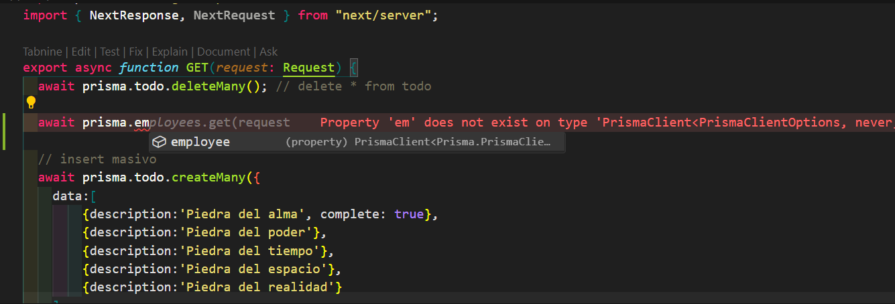

## Next + RestAPI - AdminTodos

El objetivo es crear una app TODO sin la necesidad de utilizar un gestor de estado de globales.

Puntos que vamos a trabajar:

1. Consumo de nuestro RESTful API.
2. Client y Server Side Rendering.
3. Refresh de una ruta sin afectar estados (NUEVO EN NEXT).
4. Prisma pull y push para actualizar modelos.

# Continuación del proyecto

# Development

Pasos para levantar la app en desarrollo

1. Levantar la base de datos. Esto con el docker abierto en nuestra PC.

```
docker compose up -d
```

2. Crear una copia de el .env.template, y renombrarlo a .env
3. Reemplazar las variables de entorno.
4. Ejecutar el comando `npm install`
5. Ejecutar el comando `npm run dev`
6. Ejecutar estos comando de prisma: Estos comando los ejecutamos porque la base al estar totalmente limpia no se ejecutaron los comando de migración ni el de generación del cliente (no hay regeneración del cliente ni tenemos ese schema en sintonía con nuestra base de datos).

```
npx prisma migrate dev
npx prisma generate
```

7. Ejecutar el SEED (esto es para reconstruir la base de datos local ) para [crear la base de datos local](http://localhost:3000/api/seed)

# Prisma commands

```
npx prisma init
npx prisma migrate dev
npx prisma generate
```

# Prod

# Stage

## Prisma CLI reference

[link para la documentación CLI prisma](https://www.prisma.io/docs/orm/reference/prisma-cli-reference)

Comandos db pull y db push

`db pull` : Este comando conecta con nuestra base de datos existente y agrega los modelos de forma automática en nuestro archivo de schema. Este comando es util para cuando ya tenemos una base de datos creada y queremos agregar nuestro modelos para comenzar a trabajar.

`db push` : Este comando toma nuestra definición de schema y lo pasa a la base de datos sin migraciones.

#### Situación cuando tenemos una tabla nueva en la base de dato pero no en nuestro archivo prisma

1. Creamos en TablePlus una nueva tabla:


2. Agregamos el nombre y los elementos que va a tener nuestra tabla:


3. Una vez cargados los datos de la tabla apretamos ctrl + s y se va a crear la tabla en nuestra base de datos pero no asi en nuestro prisma:


4. Tenemos que traer esa nueva tabla en nuestro schema prisma pero para evitarnos todo el trabajo de hacerlo manualmente con el comando `npx prisma db pull` nos la trae automáticamente:


Nota: en caso de realizar alguna modificación, no hay que olvidarse de hacer las migraciones pertinentes para que la base y nuestro model estén en sintonía.

5. Utilizamos este comando `npx prisma generate` este comando nos permite generar el nuevo cliente para poder trabajar con esa nueva tabla.


Ahora si vamos a nuestro seed por ejemplo y utilizamos prisma nos sale como referencia ademas del todo el nuevo model employee:



6. Al hacerle modificaciones a la nueva tabla por ejemplo modificamos el valor boolean del admin y agregamos una nueva propiedad que seria 'roles' tenemos que ejecutar un comando: `npx prisma migrate dev`


NOTA : `npx prisma migrate dev` hace una purga en la base de datos, es decir, nos borra los datos para que este en sincronía con nuestro schema.

7. Ejecutado el comando nos pregunta si queremos borrar los datos y cual seria el nombre que le vamos a poner a la migration algo similar a lo que ponemos en los títulos de nuestros commits que sea descriptivo lo que hicimos
   

#### Ahora bien, como hacemos un cambio sin tener que borrar toda la base de datos para poder implementar modificaciones en un modelo ?

8. Para ello tenemos otro comando de prisma `npx prisma db push`

En este ejemplo vamos a agregar una propiedad: lastName


Pero nuestro objetivo es evitar hacer una nueva migration porque con ello perdería todos los datos, es ahi cuando entra en juego nuestro comando `npx prisma db push` ESTO HACE LA SINCRONIZACIÓN DE LA BASE DE DATOS SOLO QUE SIN PASAR POR MIGRACIONES.

9. Para cerrar el ejercicio vamos a dejar el proyecto como lo teníamos desde un comienzo, para ello vamos a borrar el model employee, haremos una migration para dejar sincronizado el schema con nuestra base.

> [IMPORTANTE]
>
> Al hacer la migration perdemos nuestro TODOS por ende tenemos que ejecutar en POSTMAN, el endpoint de la SEED.
