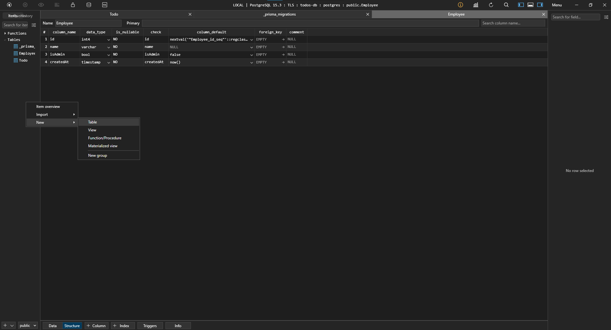
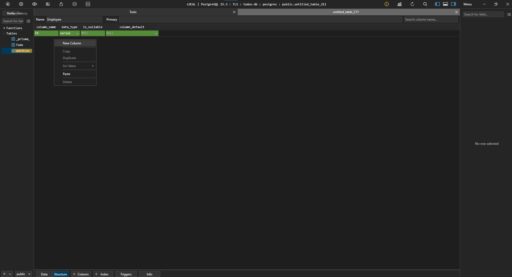
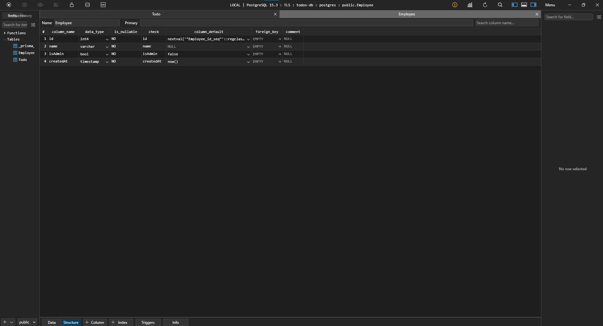
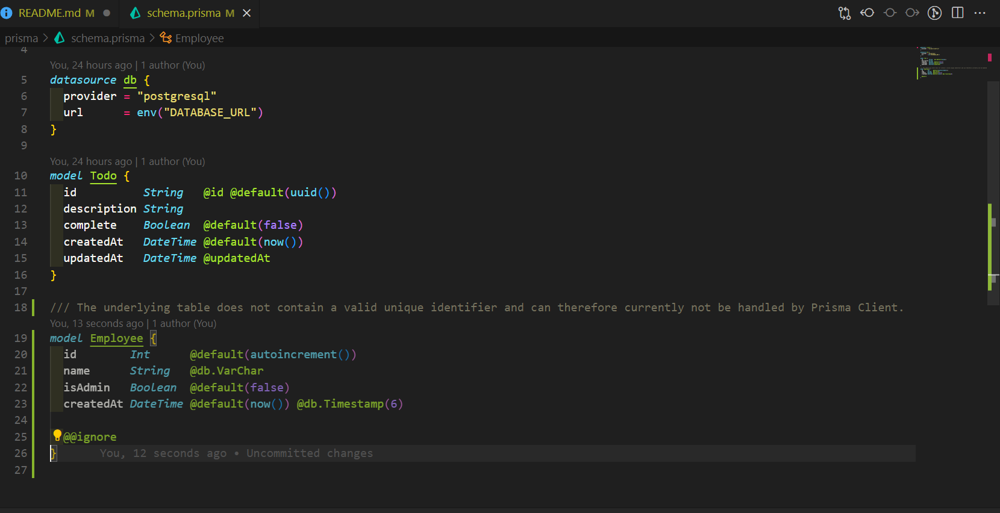
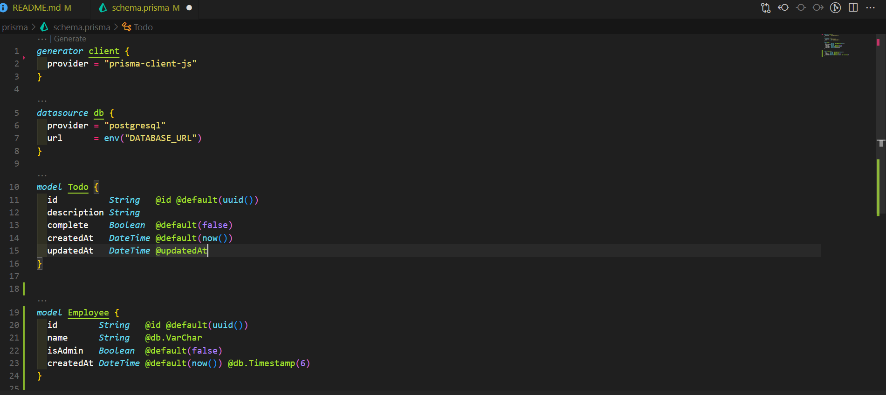
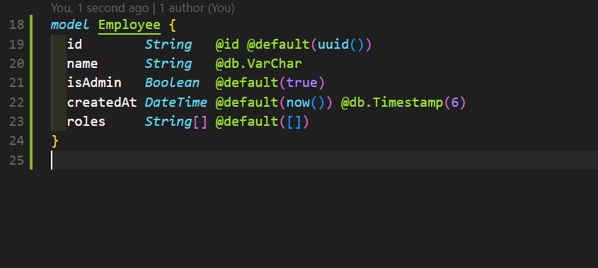
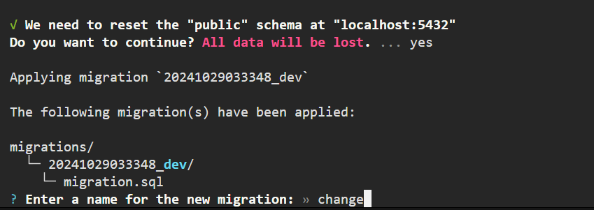
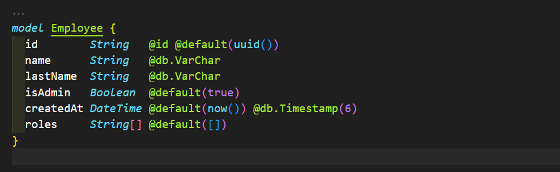
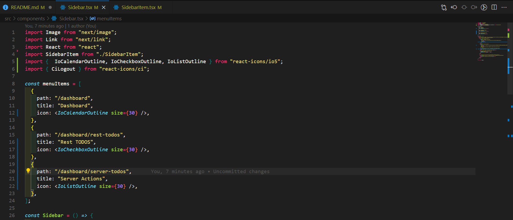
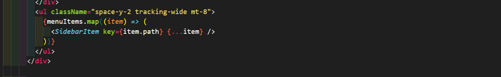

## Next + RestAPI - AdminTodos

El objetivo es crear una app TODO sin la necesidad de utilizar un gestor de estado de globales.

Puntos que vamos a trabajar:

1. Consumo de nuestro RESTful API.
2. Client y Server Side Rendering.
3. Refresh de una ruta sin afectar estados (NUEVO EN NEXT).
4. Prisma pull y push para actualizar modelos.

# Continuación del proyecto

# Development

Pasos para levantar la app en desarrollo

1. Levantar la base de datos. Esto con el docker abierto en nuestra PC.

```
docker compose up -d
```

2. Crear una copia de el .env.template, y renombrarlo a .env
3. Reemplazar las variables de entorno.
4. Ejecutar el comando `npm install`
5. Ejecutar el comando `npm run dev`
6. Ejecutar estos comando de prisma: Estos comando los ejecutamos porque la base al estar totalmente limpia no se ejecutaron los comando de migración ni el de generación del cliente (no hay regeneración del cliente ni tenemos ese schema en sintonía con nuestra base de datos).

```
npx prisma migrate dev
npx prisma generate
```

7. Ejecutar el SEED (esto es para reconstruir la base de datos local ) para [crear la base de datos local](http://localhost:3000/api/seed)

# Prisma commands

```
npx prisma init
npx prisma migrate dev
npx prisma generate
```

# Prod

# Stage

## Prisma CLI reference

[link para la documentación CLI prisma](https://www.prisma.io/docs/orm/reference/prisma-cli-reference)

Comandos db pull y db push

`db pull` : Este comando conecta con nuestra base de datos existente y agrega los modelos de forma automática en nuestro archivo de schema. Este comando es util para cuando ya tenemos una base de datos creada y queremos agregar nuestro modelos para comenzar a trabajar.

`db push` : Este comando toma nuestra definición de schema y lo pasa a la base de datos sin migraciones.

#### Situación cuando tenemos una tabla nueva en la base de dato pero no en nuestro archivo prisma

1. Creamos en TablePlus una nueva tabla:



2. Agregamos el nombre y los elementos que va a tener nuestra tabla:



3. Una vez cargados los datos de la tabla apretamos ctrl + s y se va a crear la tabla en nuestra base de datos pero no asi en nuestro prisma:



4. Tenemos que traer esa nueva tabla en nuestro schema prisma pero para evitarnos todo el trabajo de hacerlo manualmente con el comando `npx prisma db pull` nos la trae automáticamente:



Nota: en caso de realizar alguna modificación, no hay que olvidarse de hacer las migraciones pertinentes para que la base y nuestro model estén en sintonía.

5. Utilizamos este comando `npx prisma generate` este comando nos permite generar el nuevo cliente para poder trabajar con esa nueva tabla.



Ahora si vamos a nuestro seed por ejemplo y utilizamos prisma nos sale como referencia ademas del todo el nuevo model employee:


6. Al hacerle modificaciones a la nueva tabla por ejemplo modificamos el valor boolean del admin y agregamos una nueva propiedad que seria 'roles' tenemos que ejecutar un comando: `npx prisma migrate dev`



NOTA : `npx prisma migrate dev` hace una purga en la base de datos, es decir, nos borra los datos para que este en sincronía con nuestro schema.

7. Ejecutado el comando nos pregunta si queremos borrar los datos y cual seria el nombre que le vamos a poner a la migration algo similar a lo que ponemos en los títulos de nuestros commits que sea descriptivo lo que hicimos
   

#### Ahora bien, como hacemos un cambio sin tener que borrar toda la base de datos para poder implementar modificaciones en un modelo ?

8. Para ello tenemos otro comando de prisma `npx prisma db push`

En este ejemplo vamos a agregar una propiedad: lastName


Pero nuestro objetivo es evitar hacer una nueva migration porque con ello perdería todos los datos, es ahi cuando entra en juego nuestro comando `npx prisma db push` ESTO HACE LA SINCRONIZACIÓN DE LA BASE DE DATOS SOLO QUE SIN PASAR POR MIGRACIONES.

9. Para cerrar el ejercicio vamos a dejar el proyecto como lo teníamos desde un comienzo, para ello vamos a borrar el model employee, haremos una migration para dejar sincronizado el schema con nuestra base.

> [IMPORTANTE]
>
> Al hacer la migration perdemos nuestro TODOS por ende tenemos que ejecutar en POSTMAN, el endpoint de la SEED.

## Sistema de navegación

1. En el component `sidebarItem` vamos a establecer una interface.

```js
"use client";

import Link from "next/link";
import { usePathname } from "next/navigation";
import React from "react";

interface Props {
  path: string;
  icon: JSX.Element;
  title: string;
}

const SidebarItem = ({ path, icon, title }: Props) => {
  const pathName = usePathname();

  return (
    <li>
      <Link
        href={path}
        className={` px-4 py-3 flex items-center space-x-4 rounded-md  group
          hover:bg-gradient-to-r hover:bg-sky-600 hover:text-white
          ${
            path === pathName
              ? "text-white bg-gradient-to-r from-sky-600 to-cyan-400"
              : ""
          }
          `}
      >
        {icon}
        <span className=" font-medium group-hover:text-white-700">{title}</span>
      </Link>
    </li>
  );
};

export default SidebarItem;
```

2. En el component `sidebar` vamos a enviarle por props el menuItems que vamos a utilizar para crear de forma dinámica nuestros items del Sidebar.
   

3. Se lo mandamos por props al component hijo:
   

## Lista las entradas

1. Petición HTTP: Vamos a trabajar en la carpeta Rest-TODOS/page.tsx. Haremos la petición haciendo uso de useEffect() y transformando nuestro page en un use client para poder utilizarlo:

```js
"use client";

import { useEffect } from "react";

// export const metadata = {
//  title: 'Listado de Todos',
//  description: 'SEO Title',
// };

export default function RestTodosPage() {
  useEffect(() => {
    fetch("/api/todos")
      .then((resp) => resp.json())
      .then(console.log);
  }, []);

  return (
    <div>
      <h1>RestTodosPage Page</h1>
    </div>
  );
}
```

> [NOTA]
>
> si hacemos una petición del lado del cliente ya sea porque utilizamos el 'use client' o bien porque estamos dentro de efecto como useEffect() podemos tomar la url parcial. A que me refiero que no hace falta colocar: http://localhost:3000/api/todos
>
> Sino que basta unicamente con colocar '/api/todos'

2. Sacando todo el potencial de Next +13 => Porque utilizar el useEffect haciendo una petición si podemos sacar la información desde el lado del servidor:

```js
import prisma from "@/lib/prisma";

export const metadata = {
  title: "Listado de Todos",
  description: "SEO Title",
};

export default async function RestTodosPage() {
  // esto no solo nos trae los todos sino que tmb nos habilita poder utilizar la metadata.
  const todos = await prisma.todo.findMany({
    orderBy: { description: "asc" },
  });

  // useEffect(() => {
  //   fetch('/api/todos')
  //   .then( resp=> resp.json())
  //   .then(console.log);
  // }, []);

  return (
    <div>
      <h1>RestTodosPage Page</h1>
    </div>
  );
}
```

> [NOTA]
>
> Al tratarse de un SERVER COMPONENT ya tenemos acceso a los todos por medio de prisma.

## Estructura y diseño de los TODOs

Tenemos varias `técnicas` para manipular la data de los todos una vez cargado el server component:

1. Mediante un CLI COMPONENT: En SRC vamos a crear la carpeta `todos`, en donde vamos a tener las sub-carpetas (helpers, components, interfaces).

2. Creamos el component `TodosGrid.tsx`, en ese componente vamos a crear una interface para las props utilizando prisma.

```js
import React from "react";
import { Todo } from "@prisma/client";

interface Props {
  todos?: Todo[];
}

const TodosGrid = () => {
  return (
    <div>
      <span>todos grid</span>
    </div>
  );
};

export default TodosGrid;
```

NOTA: Prisma nos ofrece el tipado ya directamente de nuestros todos solamente tenemos que importarlo.

NOTA2: También tenemos la opciones de crear nuestra propia interface ajena a prisma.

3. Desde el server component (page.tsx) vamos a enviar los todos para ser usado desde el lado del cliente (TodosGrid.tsx):

##### LADO DEL SERVIDOR

```js
import prisma from "@/lib/prisma";
import TodosGrid from "@/todos/components/TodosGrid";
export const metadata = {
  title: "Listado de Todos",
  description: "SEO Title",
};
export default async function RestTodosPage() {
  const todos = await prisma.todo.findMany({
    orderBy: { description: "asc" },
  });
  return (
    <div>
      {/* TODO:FORMULARIO PARA AGREGAR  */}
      <h1>RestTodosPage Page</h1>
      <TodosGrid todos={todos} />
    </div>
  );
}
```

##### LADO DEL CLIENTE

```js
import React from "react";
import { Todo } from "@prisma/client";

interface Props {
  todos?: Todo[];
}

const TodosGrid = ({ todos = [] }: Props) => {
  return (
    <div>
      <span>todos grid</span>
    </div>
  );
};

export default TodosGrid;
```

4. Creamos un nuevo component para mapear los todos => TodoItems
   Mapeo:

```js
const TodosGrid = ({ todos = [] }: Props) => {
  return (
    <div className="gird grid-cols-1 sm:grid-cols-3 gap-2">
      {todos.map((todo) => (
        <TodoItem key={todo.id} todo={todo} />
      ))}
    </div>
  );
};
```

## Estructura y diseño de los TODOs Parte 2

Seguimos trabajando sobre la estructura y diseño del component `TodoItem`

1. Creamos un nuevo archivo de css para los estilos del component ``TodoItem` en la carpeta donde se encuentra el component.

2. Importamos el archivo de css para los estilos del component ``TodoItem` y lo utilizamos

```js
import { Todo } from "@prisma/client";
import styles from "./TodoItem.module.css";
import { IoCheckboxOutline } from "react-icons/io5";

interface Props {
  todo: Todo;
  // TODO: Acciones que quiero llamar
}

const TodoItem = ({ todo }: Props) => {
  return (
    <div className={todo.complete ? styles.todoDone : styles.todoPending}>
      <div className="flex flex-col sm:flex-row justify-start items-center gap-4 ">
        <div
          className={`
            flex p-2 rounded-md cursor-pointer 
            hover:bg-opacity-60 
            bg-blue-100
            `}
        >
          <IoCheckboxOutline size={30} />
        </div>
        <div className="text-center sm:text-left">{todo.description}</div>
      </div>
    </div>
  );
};

export default TodoItem;
```

> [IMPORTANTE]
>
> Como trabajamos con la estructura de carpeta no tenemos en esta carpeta los estilos de tailwind es por esta razón que lo tenemos que agregar en el archivo `tailwind.config.ts`.

```js
import type { Config } from "tailwindcss";

const config: Config = {
  content: [
    "./src/pages/**/*.{js,ts,jsx,tsx,mdx}",
    "./src/components/**/*.{js,ts,jsx,tsx,mdx}",
    "./src/app/**/*.{js,ts,jsx,tsx,mdx}",
    "./src/todos/**/*.{js,ts,jsx,tsx,mdx}",
  ],
  theme: {
    extend: {
      colors: {
        background: "var(--background)",
        foreground: "var(--foreground)",
      },
    },
  },
  plugins: [],
};
export default config;
```

## Actualizar Todo

Ahora le vamos a dar funcionalidad para que el user al tocar un todo cambie junto con la base de datos.

1. Dentro de la carpeta TODOS/HELPERS/ vamos a crear el archivo `todos.ts` en donde vamos a tener unicamente la petición al endpoint, es decir, a mis todos

```js
import { Todo } from "@prisma/client";

export const updateTodo = async (
  id: string,
  complete: boolean
): Promise<Todo> => {
  // apuntamos el complete de nuestro parámetro para que haga match con el complete de nuestra base de datos
  const body = { complete };

  // creamos la petición http
  // como vamos a modificar es un method PUT
  const todo = await fetch(`/api/todos/${id}`, {
    method: "PUT",
    body: JSON.stringify(body),
    headers: {
      "Content-Type": "application/json",
    },
  }).then((resp) => resp.json());

  return todo;
};
```

> [IMPORTANTE]
>
> Si mando a llamar esta función `updateTodo()` desde el lado del cliente me va a afectar la base de datos.

2. Ahora enviamos a TodoItems la función

```js
"use client";

import React from "react";
import { Todo } from "@prisma/client";
import TodoItem from "./TodoItem";

// esto es cuando tenemos muchas acciones
// nos brinda la posibilidad de tener un codigo mucho mas ordenado al saber de que carpeta o elemento estamos importante las funciones

import * as api from "@/todos/helpers/todos";

interface Props {
  todos?: Todo[];
}

const TodosGrid = ({ todos = [] }: Props) => {
  return (
    <div className="gird grid-cols-1 sm:grid-cols-3 gap-2">
      {todos.map((todo) => (
        <TodoItem key={todo.id} todo={todo} toggleTodo={api.updateTodo} />
      ))}
    </div>
  );
};
export default TodosGrid;
```

3. En TodoItem hacemos la siguiente modificación:

```js
"use client";
import { Todo } from "@prisma/client";
import styles from "./TodoItem.module.css";
import { IoCheckboxOutline, IoSquareOutline } from "react-icons/io5";

interface Props {
  todo: Todo;
  // TODO: Acciones que quiero llamar
  toggleTodo: (id: string, complete: boolean) => Promise<Todo | void>;
}

const TodoItem = ({ todo, toggleTodo }: Props) => {
  return (
    <div className={todo.complete ? styles.todoDone : styles.todoPending}>
      <div className="flex flex-col sm:flex-row justify-start items-center gap-4 ">
        <div
          onClick={() => toggleTodo(todo.id, !todo.complete)}
          className={`
            flex p-2 rounded-md cursor-pointer 
            hover:bg-opacity-60 
            ${todo.complete ? "bg-blue-100" : "bg-red-100"}
            `}
        >
          {todo.complete ? (
            <IoCheckboxOutline size={30} />
          ) : (
            <IoSquareOutline size={30} />
          )}
        </div>
        <div className="text-center sm:text-left">{todo.description}</div>
      </div>
    </div>
  );
};

export default TodoItem;
```

## Actualizar Server Component

Como no queremos que al tocar un todo tengamos que recargar la pagina para ver actualizada la información y los cambios visuales, en este caso, tachado o no el todo, vamos a implementar `actualizar la info desde el server component`

1. En el component TodosGrid vamos a crear una función adicional esto con el objetivo de aprovechar las ventajas de trabajar de Next, con esto le decimos a NEXT recarga la ruta actual y NEXT lo hace de manera tal que solo actualiza aquellos componentes que fueron afectados. Es decir, vuelve a hacer la construcción solo de ese componente.

```js
"use client";

import React from "react";
import { Todo } from "@prisma/client";
import TodoItem from "./TodoItem";

// esto es cuando tenemos muchas acciones
// nos brinda la posibilidad de tener un código mucho mas ordenado
// al saber de que carpeta o elemento estamos importante las funciones: api.update

import * as todosApi from "@/todos/helpers/todos";

interface Props {
  todos?: Todo[];
}

const TodosGrid = ({ todos = [] }: Props) => {
  const toggleTodo = async (id: string, complete: boolean) => {
    const updatedTodo = await todosApi.updateTodo(id, complete);
  };

  return (
    <div className="gird grid-cols-1 sm:grid-cols-3 gap-2">
      {todos.map((todo) => (
        <TodoItem key={todo.id} todo={todo} toggleTodo={toggleTodo} />
      ))}
    </div>
  );
};

export default TodosGrid;
```

2. Ahora lo tenemos que hacer funcionar: Para ello vamos a utilizar router de useRouter(). Con router vamos a usar una de sus propiedades `refresh()` esto para cargar solamente el componente actual (la ruta en la cual nos encontramos):

```js
"use client";

import React from "react";
import { Todo } from "@prisma/client";
import TodoItem from "./TodoItem";

// esto es cuando tenemos muchas acciones
// nos brinda la posibilidad de tener un código mucho mas ordenado
// al saber de que carpeta o elemento estamos importante las funciones: api.update

import * as todosApi from "@/todos/helpers/todos";
import { useRouter } from "next/navigation"; // asegurarse de tomar de next/navigation porque esto es lo nuevo de Next +13

interface Props {
  todos?: Todo[];
}

const TodosGrid = ({ todos = [] }: Props) => {
  const router = useRouter();

  const toggleTodo = async (id: string, complete: boolean) => {
    const updatedTodo = await todosApi.updateTodo(id, complete);
    router.refresh();
  };

  return (
    <div className="gird grid-cols-1 sm:grid-cols-3 gap-2">
      {todos.map((todo) => (
        <TodoItem key={todo.id} todo={todo} toggleTodo={toggleTodo} />
      ))}
    </div>
  );
};

export default TodosGrid;
```

> [IMPORTANTE]
>
> `useRouter()` debe ser importado de `next/navigation` porque es lo nuevo que se utiliza en NEXT +13.
>
> [!NOTA}
>
> Utilizar el router es muy poderoso en el sentido que podemos tener un state en otro componente y ya que solo afecta a los todo, por mas modificaciones que hagamos el state actual permanece, esto se debe, a que el ```refresh()``` solo afecta el componente o ruta en la cual fue utilizado.

